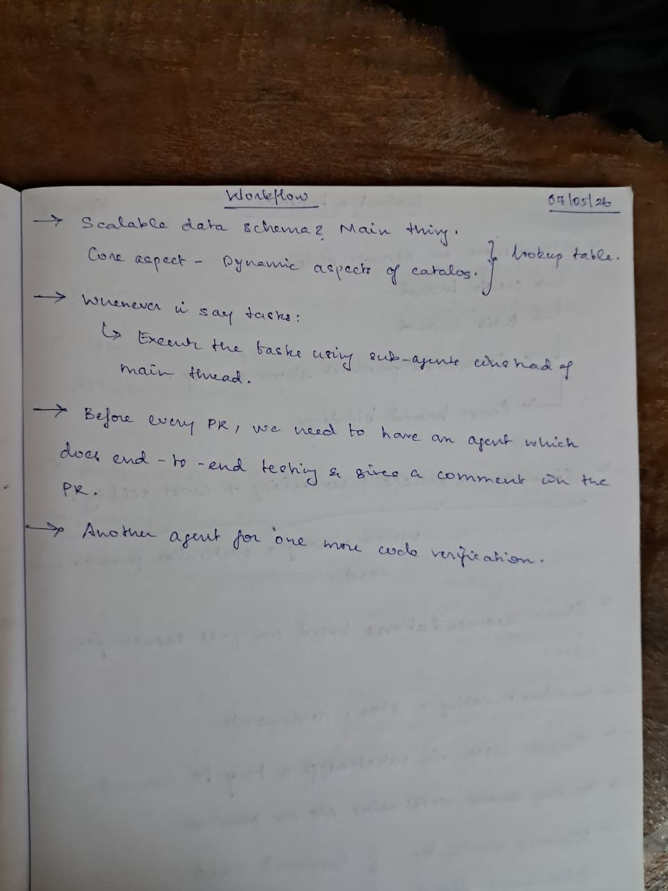

# Claude Workflow Improvements

_Transcribed from notebook, 07/05/26_



---

## 1. Task Execution Pattern

**Rule**: whenever a prompt lists multiple tasks, execute them using sub-agents in parallel ahead of the main thread — do not run sequentially.

**Why this matters**: sequential execution on independent tasks wastes wall-clock time. A 3-task sequence that takes 3× longer than it needs to is a workflow regression, not a feature.

**How to apply**:
- If tasks A and B have no dependency between them → spawn two agents simultaneously, one per task
- If task B depends on task A's output → run sequentially, but confirm the dependency explicitly before serializing
- The main agent coordinates and merges results; it doesn't do the work itself

**Current CLAUDE.md already says**: "Parallel execution is the default." This is the enforcement rule for task lists specifically.

---

## 2. Pre-PR Testing Agent

**Goal**: before every PR is raised, a dedicated agent runs the full end-to-end test suite and posts a summary comment on the PR.

**What it does**:
1. Check out the branch
2. Run backend tests (`jest`) and frontend tests (`vitest`)
3. Run any integration/e2e tests (Playwright or Supertest chains)
4. Parse results: pass count, fail count, coverage delta
5. Post a structured comment on the PR with: ✅/❌ status per suite, failed test names, coverage summary

**Why**: the current pipeline (`implement → /write-tests → /review-code → fix P0/P1 → /create-pr`) assumes tests pass before PR creation. This agent makes that assumption verifiable and visible in the PR itself — reviewers see test evidence without running locally.

**Integration point**: GitHub PR comment via `gh pr comment` or MCP github tool after `gh pr create`.

---

## 3. Code Verification Agent

**Goal**: a second independent agent reviews the PR code — separate from the test runner — and flags issues before merge.

**What it verifies** (distinct from tests):
- Architecture alignment: does the change follow the store contract? Does it respect the API envelope?
- Security: any hardcoded secrets, SQL injection vectors, unvalidated input at boundaries?
- Non-negotiables from CLAUDE.md: idempotency on webhook handlers, error logging with context, retry logic on external calls
- Code quality: commented-out code, overly complex functions, missing cleanup in useEffect hooks
- Naming and readability: are function/variable names self-documenting?

**Output**: structured report with severity (P0 / P1 / P2) — same format as `/review-code` skill. P0 and P1 block merge.

**Why two agents (tester + verifier)**: tests confirm the code does what it's supposed to do. The verifier confirms the code does it the right way. They check different things and should not be collapsed.

---

## 4. CI/CD Pipeline — Three GitHub Actions Agents

Automated agents triggered on every PR, running in parallel. Each posts PR comments and creates GitHub issues when problems are found.

**Prerequisite:** Add `ANTHROPIC_API_KEY` as a GitHub repository secret (Settings → Secrets and variables → Actions).

### Agent 1: Auto Format

**File:** `.github/workflows/format.yml`
**Trigger:** `pull_request` (opened, synchronize, reopened)

What it does:
1. Installs Prettier + ESLint from root `devDependencies`
2. Runs `prettier --write` then `eslint --fix` (Prettier first to avoid ESLint flagging lines Prettier would fix)
3. Commits any changes back to the PR branch with `"style: auto-fix formatting and lint [skip ci]"` — `[skip ci]` prevents re-trigger, but E2E and Review workflows re-run on the formatted code
4. Posts a PR comment: ✅ fixes applied, or ❌ unfixable errors with the full ESLint report
5. Fails the job if unfixable errors remain

Files to add to the project:
- `.prettierrc` — single quotes, 100 char width, trailing commas
- `eslint.config.mjs` — ESLint v9 flat config: CommonJS rules for `backend/`, ESM + JSX + React hooks rules for `frontend/`
- Root `package.json` scripts: `format:check`, `format:fix`, `lint:check`, `lint:fix`
- Root `package.json` devDependencies: `prettier`, `eslint`, `@eslint/js`, `eslint-plugin-react`, `eslint-plugin-react-hooks`, `globals`

---

### Agent 2: E2E Testing with Playwright

**File:** `.github/workflows/e2e.yml`
**Trigger:** `pull_request` (opened, synchronize, reopened)

What it does:
1. Installs Playwright (Chromium only — ~1 min; all browsers ~5 min, unnecessary for functional testing)
2. Runs unit + integration tests first as a fast gate — if Jest/Vitest fail, skip the browser launch
3. Playwright's built-in `webServer` starts `node backend/src/server.js` and `vite dev`, polls readiness before running any test (no `sleep` hacks)
4. Runs 12 E2E tests across catalog and admin pages
5. Uploads HTML report + failure screenshots as artifacts (7-day retention)
6. Claude (`anthropics/claude-code-action@beta`) posts a PR comment with pass/fail table, duration, and root-cause analysis for failures
7. On failure: Claude creates a GitHub issue per failing test — title `"E2E Failure: <test name>"`, body includes exact assertion, screenshot path, and local reproduction steps

Files to add to the project:
- `e2e/package.json` — `@playwright/test` only (isolated from workspace)
- `e2e/playwright.config.js` — `webServer` config, Chromium only, 1 retry, JSON + HTML reporters
- `e2e/tests/catalog.spec.js` — 6 tests: page loads with products, search filter, category filter, brand filter, price range, click card → detail modal
- `e2e/tests/admin.spec.js` — 6 tests: admin layout loads, brand sidebar lists brands, brand click filters table, Add Product button opens form, form has required fields, submit creates product

Verified CSS selectors (from source):
`.product-card`, `.product-card__name`, `.product-card__meta`, `.product-card__brand`, `.search-filter__input`, `#category-select`, `.admin-layout`, `.admin-sidebar`, `.brand-item`, `.btn-add`, `.product-table`, `.admin-empty`

---

### Agent 3: AI Code Review

**File:** `.github/workflows/review.yml`
**Trigger:** `pull_request` (opened, synchronize — NOT reopened, to avoid reviews when no new code was pushed)

What it does:
1. Fetches the full PR diff (`git diff origin/$BASE...HEAD`)
2. Claude (`anthropics/claude-code-action@beta`) reviews the diff against the project's invariants
3. Posts inline PR review comments on specific file + line numbers, grouped by severity
4. Submits the review as `REQUEST_CHANGES` (P0 found), `COMMENT` (P1/P2 only), or `APPROVE` (nothing significant)
5. For each P0/P1: creates a GitHub issue `"Review: <description>"` with file, line, problem, why it breaks the system, and the exact fix

Severity tiers baked into the prompt:

| Tier | Meaning | Examples |
|------|---------|---------|
| P0 — blocking | Must fix before merge | `app.js` calling `listen()`, store contract violation, silent catch block, API envelope violation, missing `brandId` FK validation |
| P1 — should fix | Important quality issue | Missing try/catch on new routes, hardcoded port/secret, React `useEffect` without cleanup, missing input validation on new endpoints |
| P2 — suggestion | Non-blocking improvement | Logic simplification, missing `aria-label`, naming inconsistency, O(n²) in hot path |

Project invariants embedded in the review prompt:
- Store contract: `inMemoryStore.js` exports exactly `{ create, findById, update, remove, search, clear }`
- `app.js` must never call `listen()` — Supertest depends on this
- API envelope: all responses must be `{ success: boolean, data: any, error: { code, message } | null }`
- All errors logged as `{ timestamp, operation, input, error, stack }`
- React `useEffect` that sets state from async calls must return a cleanup/cancel function

---

### Implementation Order

Each step is independently deployable:

1. Add Prettier + ESLint config (`.prettierrc`, `eslint.config.mjs`, root `package.json` scripts) — zero risk, additive only
2. Deploy Agent 1 (format workflow)
3. Write Playwright E2E tests (`e2e/` directory, 12 tests) — verify locally with `cd e2e && npm test`
4. Add `ANTHROPIC_API_KEY` to GitHub secrets
5. Deploy Agent 2 (E2E workflow)
6. Deploy Agent 3 (review workflow)

### Files to Create

| File | Purpose |
|------|---------|
| `.github/workflows/format.yml` | Agent 1: auto-format |
| `.github/workflows/e2e.yml` | Agent 2: E2E tests |
| `.github/workflows/review.yml` | Agent 3: AI code review |
| `.prettierrc` | Prettier config |
| `eslint.config.mjs` | ESLint flat config |
| `e2e/package.json` | Playwright dependency isolation |
| `e2e/playwright.config.js` | webServer + test config |
| `e2e/tests/catalog.spec.js` | Catalog E2E tests |
| `e2e/tests/admin.spec.js` | Admin E2E tests |

---

## 5. Scalable Data Schema Design (Agent-Assisted)

**The question from the notebook**: "Scalable data schema? Main thing. Core aspect — dynamic aspects of catalogs → lookup table."

**What this means for agent work**: when designing or migrating the data schema (in-memory → Postgres), spawn an agent specifically to evaluate the attribute-lookup table design before any implementation starts.

**Agent prompt pattern**:
```
Given: product catalog with dynamic, category-specific attributes (e.g. "RAM" 
for electronics, "fabric" for clothing). Attribute types and allowed values 
change without code deploys. Design a Postgres schema that:
1. Supports dynamic attributes without per-attribute migrations
2. Allows efficient filtering by attribute value
3. Keeps the product table clean (no nullable columns per attribute)

Evaluate: EAV table, JSONB column, separate attribute-lookup table. 
Pick the best fit for this read-heavy catalog use case and explain the tradeoff.
```

This evaluation happens once, produces an ADR, and the schema decision is locked before any table creation.
