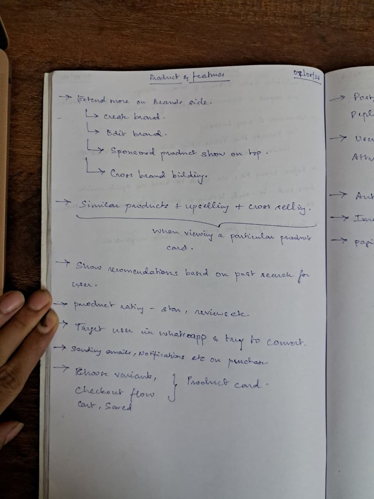

# Product Features — Potential Improvements

_Transcribed from notebook, 07/05/26_

---

## 1. Brand Extensions

Create brand and edit brand are already built (`/api/v1/brands`). Remaining work:

- **Sponsored products on top** — priority flag at brand or product level; products with `sponsored: true` surface before organic results in listing/search
- **Cross-brand building** — brand collections (curated sets across brands), brand-level landing pages, brand affinity linking

---

## 2. Product Discovery on Product Card

Triggered when a user is viewing a specific product (ProductDetail view):

- **Similar products** — products sharing the same category, tags, or overlapping attributes
- **Upselling** — higher-tier products in the same category (e.g. premium version of what they're viewing)
- **Cross-selling** — complementary products from adjacent categories (e.g. accessories for the viewed item)

---

## 3. Personalized Recommendations

- Track past search queries and browsed products per user session / account
- Surface a "You might like" rail on the homepage and search results page based on that history
- Requires user identity (see Auth section below) to persist across sessions

---

## 4. Ratings & Reviews

- **Star rating** — 1–5 stars per product, aggregate shown on ProductCard
- **Written reviews** — freetext review with author, date, and star score
- **Review moderation** — flag/hide inappropriate reviews (admin action)
- Review count and average rating indexed per product for sort/filter use

---

## 5. WhatsApp Targeting & Conversion

- Identify users who viewed a product but did not purchase
- Send targeted WhatsApp message with product link, image, and call-to-action
- Integration pattern: Wati webhook (same pattern as existing Wati integrations)
- Requires user phone number from profile (see User Attributes section)

---

## 6. Email & Notification Pipeline

**Transactional:**
- Purchase confirmation email with order summary
- Order status updates (shipped, delivered)

**Marketing / Re-engagement:**
- Abandoned cart email (triggered after cart inactivity)
- Price drop alert for saved/wishlisted items
- Post-purchase review prompt

---

## 7. Shopping Journey on Product Card

All of these live on or directly behind the ProductCard / ProductDetail view:

- **Inline variant picker** — color swatches, size pills, quantity selector directly on card (not just in detail view)
- **Add to cart** — add selected variant + quantity; cart persists across page navigations
- **Cart management** — update quantity, remove item, view cart summary, cart total
- **Saved / Wishlist** — save product for later; saved list view; move saved → cart
- **Checkout flow** — step-by-step: cart review → shipping address → payment → order confirmation

---

## 8. Post-Purchase Pipeline

- Order tracking status (processing → shipped → delivered)
- Automated review prompt after delivery
- Re-engagement campaign trigger (e.g. "buy again" suggestion after 30 days)
- Returns / refund request flow

---

## 9. User Attributes & Personalization

- User profile: name, email, phone, shipping addresses
- Purchase history linked to account
- Browsing / search history for recommendation engine input
- Preference tags (inferred or explicit) to tune product ranking

---

## 10. Authentication

- User registration (email + password) and login
- Session management (JWT or server-side session)
- Link cart, saved items, order history, and browsing history to authenticated account
- Guest checkout with optional post-purchase account creation
- Roles: guest, customer, admin (see `technical.md` for RBAC detail)
